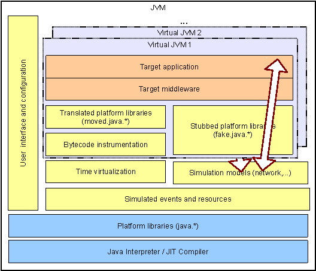

(formerly hosted at *www.minha.pt*)

The correctness and performance of large scale distributed systems depends on middleware components performing various communication and coordination functions. It is, however, very difficult to experimentally assess such middleware components as interesting behavior often arises exclusively in large scale settings, with costly and time consuming distributed deployments with realistic workloads.

Minha virtualizes multiple JVM instances in each JVM while simulating key environment components, reproducing the concurrency, distribution, and performance characteristics of a much larger distributed system. It enables that multiple instances run in each JVM, significantly reducing the resources required by typical alternatives. Moreover, by virtualizing time using simulation, it reduces the interference resulting from competing for shared resources and provides a time reference and control point.

The application and middleware classes for each instance are loaded by a custom class loader that replaces native libraries and synchronization bytecode for references to simulation models. Most of the code is run unmodified and time is accounted using the CPU time-stamp counter to closely obtain true performance characteristics. Some of these simulation models are developed from scratch while others are produced by translating native libraries themselves. The resulting code makes use of the simulation kernel and time virtualization to run. Multiple instances are loaded under the control of a command line user interface and configuration loader.

### Goals

This project is extending the Minha platform towards supporting a wider range of middleware and environments as follows:

* **Distributed simulation kernel.** The current implementation is centralized and takes very limited advantage of multi-cores, limiting the scale of experiments. By implementing or integrating a parallel and distributed simulation kernel, existing multi-core servers and cloud infrastructure can be used to scale-out experiments.
* **Additional platform APIs.** Running a large diversity of middleware components requires providing all their dependencies on the Java platform API in terms of simulation models. Currently, the main limitation of Minha is a limited support for java.nio and java.util.concurrent APIs, that are required for many modern distributed middleware packages.
  * NIO support, including selectors, has been merged
* **Simulation of multi-core processors.** Validation and optimization of middleware components for multi-core processors is increasingly important. By implementing a multi-core model with Minha, it will be possible to run experiments with a large number of cores thus preparing for current and future hardware configurations.
* **Storage models and calibration.** Although the main model required for distributed components is the network, storage I/O has also a significant impact in the performance many  systems due to the use of logging for recovery. Implementing and calibrating a storage model will also allow data management systems to be tested.
* **Support for application models.** Building a global application model on Minha currently requires in depth knowledge of the simulation kernel and a substantial amount of boilerplate code. We aim at simplifying this task, namely, by building a support infrastructure and integrating an object mocking framework.
* **Case studies.** The evolution of the Minha platform is driven mainly by the components that it is able to run, and then, what contribution to those components can be done by applying Minha. Tested packages include NeEM, jGCS, JGroups, HSQLDB, and YCSB.

### Motivation

Experimental evaluation of middleware usually requires instances of a stub application deployed in multiple hosts to accurately reproduce the impact of distribution and avoid mutual interference. The amount of required hardware resources to assess systems aimed at large scale is thus significant. Moreover, a distributed system is inherently difficult to observe due to the lack of a time reference and central control point.

As a consequence, many middleware components have performance bottlenecks and even outright flaws that are exposed only in production in large scale deployments and with real workloads. For instance, in small scale deployments with several instances in the same or in a few physical hosts, concurrency issues might not be exposed, scalability challenges do not arise (e.g. unstable performance or oscillation), and run-time complexity of embedded algorithms is left unchecked.

The goal of this project is to provide a platform that has the following desirable properties:

* **Practical large scale.** It should be possible to \uline{improve the scale of testing by 100 times in the same hardware}, both by virtualizing time (i.e. trading hardware resources for longer running tests) and simulating the environment, while at the same time making test outcomes more deterministic and thus repeatable.
* **Global observation without interference.** Once the time across the system is virtualized, it is possible to get a global observation of all operation and system variables. Contrary to execution in a real environment, there is no overhead introduced by observation and control, even debugging, so execution time can be considered for analysis. Moreover, distributed execution and state can be observed consistently by any simple debuggers.
* **Deployment of incomplete systems.** When in a real execution, still in the development phase, it is necessary to evaluate the system for different environments (e.g. network configurations) and software components (i.e. the application layer on top of the middleware). Our goal is that  environments and software models can be replaced by simulation models, and incorporated in a standard test harness to be run automatically as code evolves.
* **Automated** ``What-If'' analysis. By resorting to simulated components and running the system with varying parameters, the impact of extreme environments can be assessed, exploring even conditions that are not yet possible in practice. In fact, this can even be automated by having parameters to be generated automatically in order to seek for a given observable condition, e.g. the number of CPU cores to which some code scales up to.

## Research and publications

Research leading to Minha is described here:

* [MMN+19] N. Machado, F. Maia, F. Neves, F. Coelho, J. Pereira, [Minha: Large-Scale Distributed Systems Testing Made Practical](https://www.google.com/url?q=https%3A%2F%2Fdrops.dagstuhl.de%2Fopus%2Fvolltexte%2F2020%2F11797%2F&sa=D&sntz=1&usg=AOvVaw2CvMzdc0fa5uSrrai7MNPh). International Conference on Principles of Distributed Systems (OPODIS).

* [JMM+15] T. Jorge, F. Maia, M. Matos, J. Pereira, and R. Oliveira. [Practical evaluation of large scale applications](https://www.google.com/url?q=https%3A%2F%2Flink.springer.com%2Fcontent%2Fpdf%2F10.1007%2F978-3-319-19129-4_10.pdf&sa=D&sntz=1&usg=AOvVaw2gU1GOOnjuEP_J9D7Slc6B). In Distributed Applications and Interoperable Systems (DAIS, with DisCoTec), Lecture Notes in Computer Science (LNCS). Springer, 2015.

* [CBCP11] N. A. Carvalho, J. Bordalo, F. Campos, and J. Pereira. [Experimental evaluation of distributed middleware with a virtualized java environment](http://scholar.google.com/citations?view_op=view_citation&hl=en&user=0No68O8AAAAJ&cstart=60&citation_for_view=0No68O8AAAAJ:UHK10RUVsp4C). In MW4SOC '11: Proceedings of the 6th workshop on Middleware for service oriented computing, 2011.

Some results obtained with Minha (current and past versions):

* [MMV+14] Francisco Maia, Miguel Matos, Ricardo Vilaça, José Pereira, Rui Oliveira, and Etienne Rivière. [Dataflasks: Epidemic store for massive scale systems](https://www.google.com/url?q=https%3A%2F%2Fieeexplore.ieee.org%2Fdocument%2F6983382&sa=D&sntz=1&usg=AOvVaw2vDRw6cka7CQ44WGUZlgzw). In SRDS ’14. IEEE Computer Society, 2014.

* [SPS+05] A. Sousa, J. Pereira, L. Soares, A. Correia Jr., L. Rocha, R. Oliveira, and F. Moura. [Testing the dependability and performance of group communication based database replication protocols](http://scholar.google.com/citations?view_op=view_citation&hl=en&user=0No68O8AAAAJ&citation_for_view=0No68O8AAAAJ:dshw04ExmUIC). In IEEE/IFIP International Conference on Dependable Systems and Networks, pages 792–801. IEEE Computer Society, 2005.

* [CSS+05] A. Correia Jr., A. Sousa, L. Soares, J. Pereira, F. Moura, and R. Oliveira. [Group-based replication of on-line transaction processing servers](http://scholar.google.com/citations?view_op=view_citation&hl=en&user=0No68O8AAAAJ&citation_for_view=0No68O8AAAAJ:XiSMed-E-HIC). In C. Maziero, J. Silva, A. Santos Andrade, and F. Silva, editors, Proc. of Latin-American Symp. Dependable Computing, volume 3747 of Lecture Notes in Computer Science, pages 245–260. Springer Verlag, 2005.

## Source code

Source code is available at https://github.com/jopereira/minha. See the wiki for installation, usage and development instructions.

## Team and funding

Minha is developed by [José Pereira](https://github.com/jopereira) with contributions from N. Carvalho, J. Bordalo, F. Campos, [J.M. Gomes](https://github.com/pedro132), [P. Guimarães](https://github.com/pedro132), and [N. Machado](https://github.com/nunomachado).

Research and development was funded by a [Google Research Award](http://www.google.com/url?q=http%3A%2F%2Fgoogleresearch.blogspot.com%2F2012%2F07%2Fgoogle-research-awards-summer-2012.html&sa=D&sntz=1&usg=AOvVaw1FeHkSgH96x_SUzYRVWxUI) and by FCT through project [ReD](http://www.google.com/url?q=http%3A%2F%2Fred.lsd.di.uminho.pt&sa=D&sntz=1&usg=AOvVaw2vUOL-y8CbrUEVZcOnwwUf).

